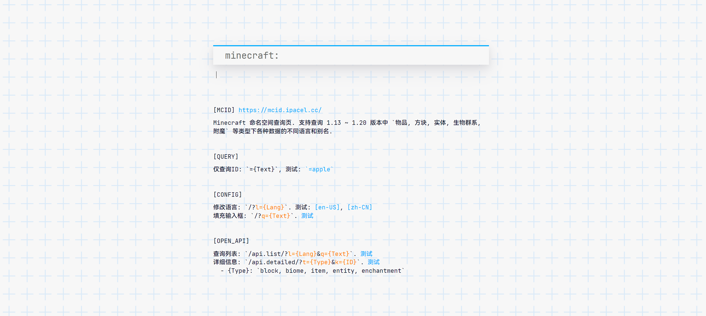

# mcid.ipacel.cc
Minecraft 命名空间查询页. 支持查询多个版本中 `物品, 方块, 实体, 生物群系, 附魔` 等类型下各种数据的不同语言和别名.



## 项目文件结构
例举了一些比较重要的文件, 完整目录请看存储库 ~
```
httpApi			-- API
tool			-- 工具脚本
	getData.js		-- 从游戏目录中读取语言文件并存入数据库
	getImg.js		-- 从 wiki 上下载一些图片
	getVer.js		-- 将 `util/mcVer.js` 中的数据导入到数据库
util			-- 工具代码
	db.js			-- 存放了数据库表结构
	dbUtil.js		-- 存放了一些麻烦的查询语句
www			-- 前端静态文件
	img			-- MC 物件图像, 未整理
	lang			-- 前端语言文件
	index.html		-- 前端主页面
index.js		-- 在这里启动
httpServer.js		-- HTTP 服务器及其配置, 默认开启 HTTP2, 需要添加证书文件...
```

## 未解决的问题
- [ ] 渲染方块与实体的方法: 目前使用的渲染图通过一个模组生成, 效果不太理想.
- [ ] 自动更新 MC 版本号和数据.
